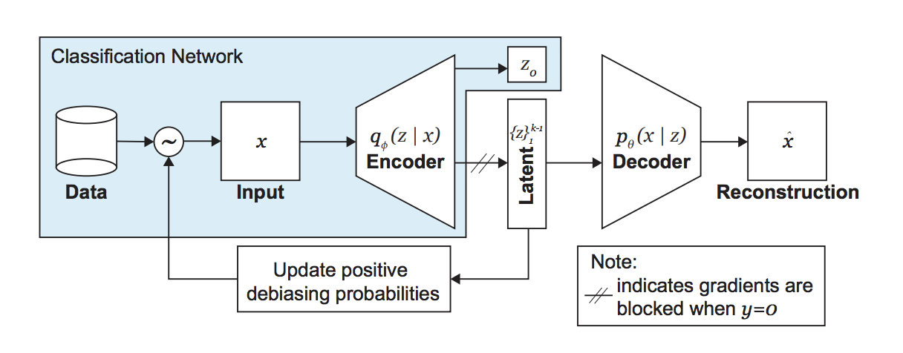
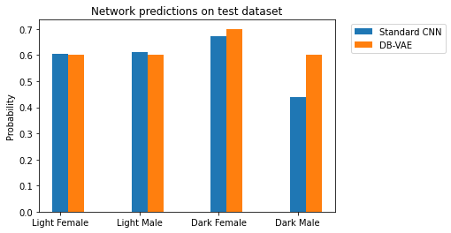

# Debiasing-Facial-Detection

## Mitigating algorithmic bias

https://www.youtube.com/watch?v=59bMh59JQDo&feature=emb_logo

Watch the video to get insights about Human Bias and how it effects our Machine learning model.

## Variational autoencoder (VAE)
We can reduce the algorithmic Bias using VAE.It is an autoencoder whose encodings distribution is regularised during the training in    order to ensure that its latent space has good properties allowing us to generate some new data.

## Debiasing variational autoencoder architecture (DB-VAE)

## Comparison between CNN and DB-VAE

As we can see that the our model is less biased in DB-VAE.

# Resources

## Dataset
positive image http://mmlab.ie.cuhk.edu.hk/projects/CelebA.html
Negative image http://www.image-net.org/

## Refrences
http://introtodeeplearning.com/AAAI_MitigatingAlgorithmicBias.pdf

https://towardsdatascience.com/understanding-variational-autoencoders-vaes-f70510919f73

© MIT 6.S191: Introduction to Deep Learning
http://introtodeeplearning.com

